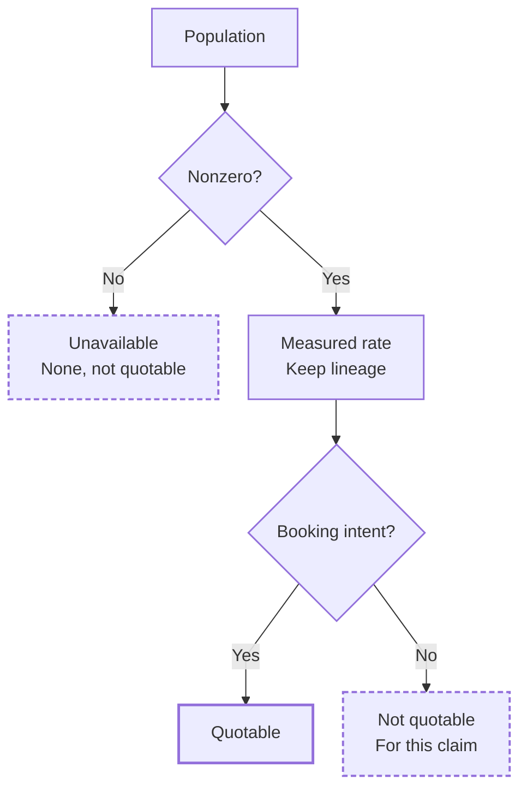
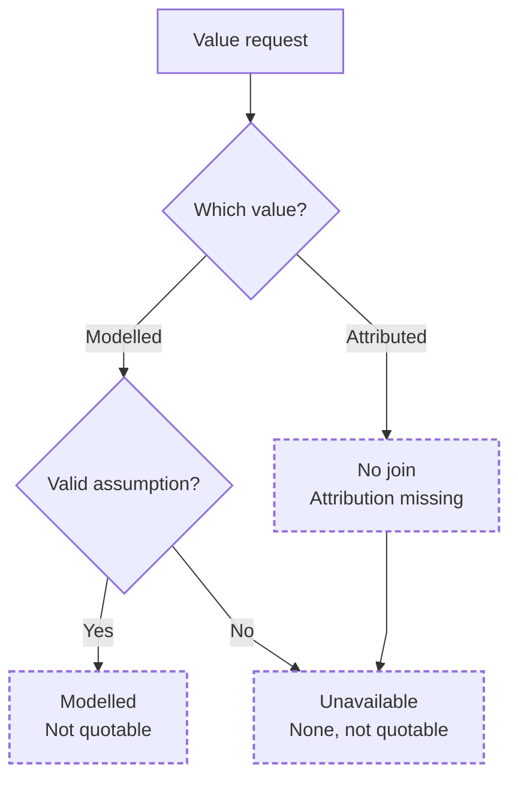

# Metric Integrity

A small Python example for keeping a metric's lineage attached to the number: the population it describes, the calculation that produced it, the evidence basis, and whether the result is safe to quote.

**Decimal places are not a permission slip.**

This is a public sample of reporting rules from my private voice/booking analytics work. Synthetic records make the evidence easy to inspect. I can extend these rules into the surrounding reports, dashboards, and integrations for other workflows.

## Measured rates: check the denominator before quoting

The named denominator must be nonzero. The rate retains its calculation lineage and `measured` basis. For the booking-intent success claim, the booking-intent population is quotable; the all-call population is not.

## Value estimates: expose the assumption or missing evidence

Modelled value multiplies the measured booked count by a **positive, finite** configured per-booking assumption. It remains `modelled` and not quotable. Missing or invalid assumptions yield `unavailable`, with `value = None`. Attributed recovered revenue is also unavailable because this sample has no durable attribution join.

## One sample, four different claims

The demo uses **34 synthetic calls**: 14 express booking intent and 4 book. The same records can support different arithmetic without supporting the same sentence.

| Figure | Value | Population / calculation | Basis | Safe to quote for this claim? |
|---|---:|---|---|---|
| Booking rate vs calls expressing booking intent | 28.6% | calls expressing booking intent; 4 / 14 | `measured` | Yes |
| Booking rate vs all calls | 11.8% | all calls; 4 / 34 | `measured` | No — wrong denominator for the booking-intent success claim |
| Modelled value of booked calls | 4,800 | 4 booked calls × configured 1,200 assumption | `modelled` | No — an assumption participates in the value |
| Recovered revenue attributed to recovered calls | not available | no durable attribution join | `unavailable` | No — the evidence required for attribution does not exist |

**Quotable is a separate decision from evidence basis:** even a measured figure can use the wrong population for the intended claim.

## Where the behavior lives

| File | What to inspect |
|---|---|
| `src/metric_integrity/models.py` | `Figure`: value, population, calculation inputs, basis, and quote decision |
| `src/metric_integrity/rates.py` | named denominator populations and rate construction |
| `src/metric_integrity/valuation.py` | configured modelled booked-call value and explicit attribution refusal |
| `src/metric_integrity/report.py` | report composition and limitations |
| `tests/` | denominator, basis, quote-safety, attribution, unavailable-state, and finite-value checks |

## Evidence boundary

The records are synthetic, not customer or revenue results. `unavailable` means missing evidence, not a low estimate in disguise.

Verification commands and expected checks: [docs/verification.md](docs/verification.md)

See [PROVENANCE.md](PROVENANCE.md), [docs/invariants.md](docs/invariants.md), and [docs/failure-modes.md](docs/failure-modes.md) for the public boundary and the rules the tests protect.
