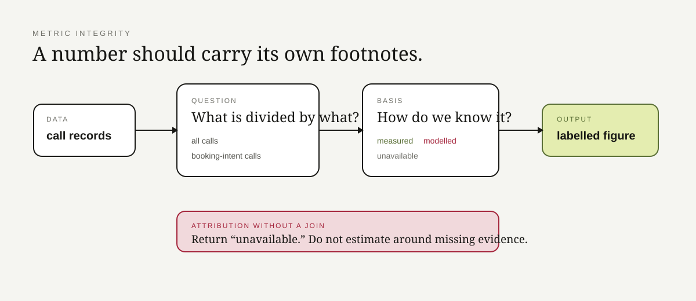

# Metric Integrity

**If a percentage cannot tell me what it is divided by, it is going back to math class.**

This repo is about making dashboard numbers carry their meaning with them.

A figure here knows:

- its value;
- its basis: measured, modelled, or unavailable;
- what population its rate is about;
- whether it is safe to quote.

## The three bugs this avoids

### Wrong denominator

Four bookings divided by booking-intent calls and four bookings divided by every call are both valid arithmetic.

They are not the same business claim.

### Modelled becomes “real” through formatting

A configured assumption multiplied by a real count is still a modelled estimate.

### Unsupported attribution gets invented

If the data has no durable join proving which later booking came from which earlier call, the honest result is **unavailable**.

## Repo map

| Area | Responsibility |
|---|---|
| `models.py` | basis, denominator, figures, call records |
| `report.py` | denominator-aware calculations + limitations |
| `tests/` | basis, denominator, attribution behavior |
| `docs/` | design reasoning |

This is deliberately small. It is easier to audit one boring number pipeline than a dashboard full of decorative certainty.

> Multiplication does not upgrade an assumption into a fact.
